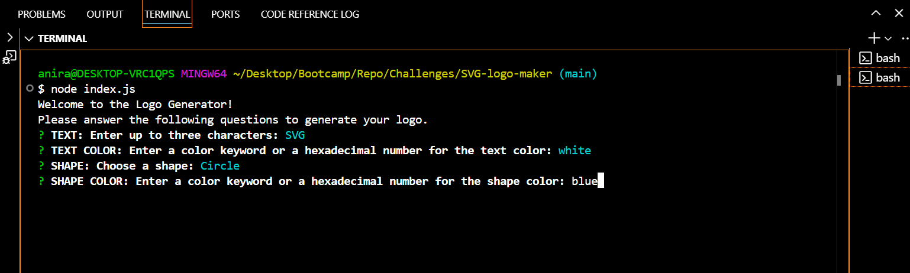
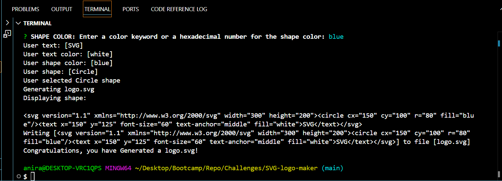
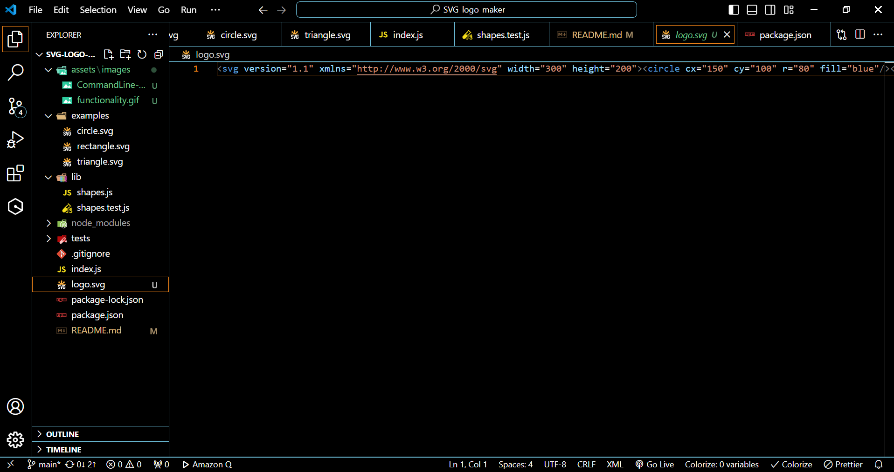

# SVG Logo Maker

A simple command line application that can be used to create SVG logo fies.The application enables users to enter inputs into a inquirer prompt in order to generate a logo "logo.svg" file which contains the users desired results as an SVG image.

## Description
This Node.js command-line application generates SVG logos based on user input. It allows users to select a color and shape, provide text for the logo, and then saves the generated SVG file. User inputs are collected using the inquirer prompt.

The following animation demonstrates the application functionality: 

This application was built as a way to allow freelance web developers to create simple logos for their clients and projects so that they can forego paying a graphic designer. It utilizes inquirer to prompt the user within the command line for how they would like their logo to look (ie. what text they would like their logo to display (up to 3 characters in length), the color of that text, the shape of their logo (triangle, square, or circle) and the color of that shape.) Once the user answers all prompts, then an SVG file is written using their selections to generate a logo. This application also is my first implementation of unit testing within my applications. It utilizes one test suite, with three tests, all which are simply testing that the code base is delivering back correct shapes and colors. Building this application served as yet another look at what back-end developers can do without the use of a UI (user interface). Future development on this application could start with adding on more error handling (SVG colors), additional unit testing, and adding more polygons and font styles for users to choose from.

## Getting Started
The screenshot of the commond line will look like this:

Once the user enters the text, text-color, shape and color of the logo in the commond prompt, the logo will be generated and saved as logo.svg. A message will be printed to the command line informing the user that the logo is sucessfully generated. The complete command line prompt will look like the following image:

The generated SVG file looks like the following image:

A few examples of the generated logo's are saved in the Examples folder and the logo's should look like these:

The whole workflow of the application is shown in the following video.

The existing svg files will be replaced every time user run's the commandline application, so it need to moved to another folder to save it before running the app again.
### Dependencies

* inquirer 8.2.4
* jest 28.1.3

### Installing

* Clone the repo: git clone https://github.com/aniraannu/SVG-logo-maker

* Open in VS Code. If you do not have VS code you must install it.

* Using the terminal, install node.js v16. If you have homebrew, the command should look like the following (brew install node@16), however this may vary and the documentation should be consulted.

* Once node.js v16 is installed, in the terminal, utilize the command npm init -y to initialize and create a package.json where project files will be stored.

* Next, use the terminal to run the command npm i to install the dependencies associated with this application (developers may need to install inquirer and jest directly from the command line, to do so the command for inquirer will be npm i inquirer@8.2.4 to install v8.2.4 of the inquirer, and npm i jest to install the latest version of jest).

* To run the application, within the terminal, type the command node index.js.

### Executing program

* The application code can be cloned from the following Github link:
[GitHub-note-taker](https://github.com/aniraannu/SVG-logo-maker)

## Help

NA

## Authors

Contributors names and contact info

Anira Raveendran
[@aniraannu](https://github.com/aniraannu)

## Version History

* 0.1
    * Initial Release

## License

None

## Acknowledgments

Inspiration, code snippets, etc.

* [dbader](https://github.com/dbader/readme-template)